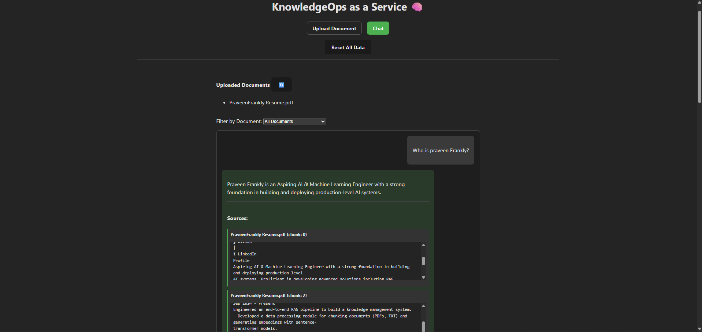

# KnowledgeOps as a Service (KaaS) Project 🚀

[](https://fastapi.tiangolo.com/)
[](https://www.docker.com/)
[](https://www.langchain.com/)

This is a minimal but realistic implementation of a "Knowledge as a Service" system, often called Retrieval-Augmented Generation (RAG). It allows you to upload documents (PDFs/TXTs) and ask questions about their content.

---

## 🔮 Roadmap
- [x] Phase 1: Core RAG API ✅ *(Document ingestion, chunking, embeddings, retrieval pipeline)*
- [x] Phase 2: Platform & Ingestors *(Frontend + Multi-format ingestion – current stage)*
- [ ] Phase 3: Intelligence Layer *(Agentic querying, reasoning chains, self-improvement loop)*
- [ ] Phase 4: MLOps Polish *(Monitoring, logging, evaluation, deployment automation)*

---

## 🧭 Next Phase: What's Coming
As the next step, I’ll be expanding the **Intelligence Layer** by integrating:
- Multi-agent orchestration (LangGraph or CrewAI)
- Knowledge routing and contextual summarization
- Experiment tracking via MLflow or LangSmith
- API gateway for external integrations

---

It uses a modern stack: Python FastAPI for the backend, React for the frontend, and Chroma for vector storage.

## Architecture

The system is composed of three main services orchestrated by Docker Compose:

1.  **Backend (FastAPI)**: Handles API requests for document ingestion and querying.
2.  **Frontend (React)**: A simple web UI for uploading files and chatting with your documents.
3.  **Chroma (Vector DB)**: Runs as a persistent local vector store using a Docker volume.


### Key Features
* **Document Upload**: Supports `.pdf` and `.txt` files.
* **Semantic Search**: Ask questions in natural language.
* **Generative Answers**: Uses Groq's LPU Inference Engine for fast answers or falls back to a local Hugging Face model (`flan-t5-base`).
* **Source Citing**: Answers include citations pointing to the exact source document and text snippet.
* **Simple & Local-First**: Runs entirely on your machine with Docker Compose. No GPU required for the fallback model.


---

## 🔹Results


 





 


---
  

## ⚙️ Setup & Running Locally

### Prerequisites
* Docker and Docker Compose
* Git

### 1. Clone the Repository
```bash
git clone <your-repo-url>
cd <your-repo-folder>
```

### 2. Configure Environment Variables
Copy the example environment file and fill in your details.

```bash
cp .env.example .env
```

You'll need to edit the .env file:

| Variable      | Required | Description                                   |
|---------------|----------|-----------------------------------------------|
| GROQ_API_KEY  | Optional | Get free key from Groq. Enables fast answers. |
| HF_FALLBACK   | Optional | Set `true` to use flan-t5-base locally.       |

The backend automatically routes queries to Groq if GROQ_API_KEY is present, else falls back to HuggingFace.

### 3. Build and Run with Docker Compose
This single command will build the frontend and backend images, and start all services.

```bash
docker-compose up --build
```

The Frontend UI will be available at http://localhost:3000.

The Backend API Docs (Swagger UI) will be at http://localhost:8000/docs.

### 4. Stopping the Services
To stop the application, press Ctrl+C in the terminal where docker-compose is running. To remove the containers:

```bash
docker-compose down
```
To remove the persistent data (vector database and uploaded files), remove the chroma_db, storage, and kaas.db files/directories.

⚠️ This will permanently delete all uploaded documents and embeddings.

---------------------------------------------------------------------------------------------

## License
MIT License — free to use and modify.

## Contributing
PRs welcome! Please open an issue for discussions.
